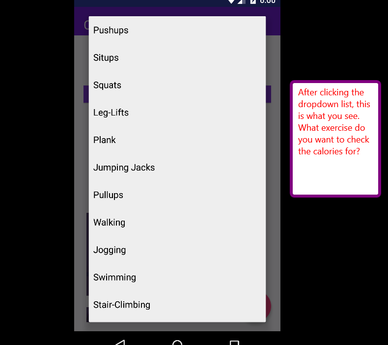
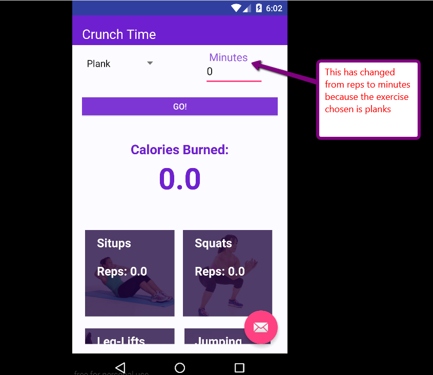
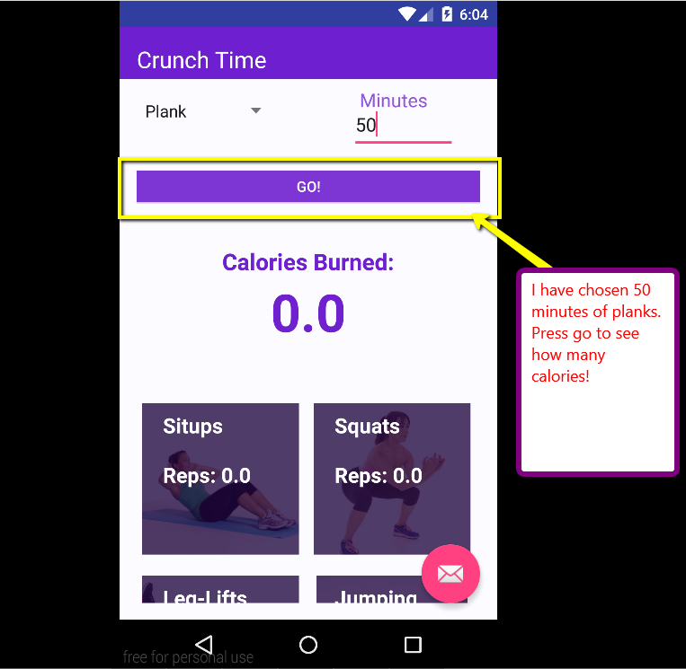
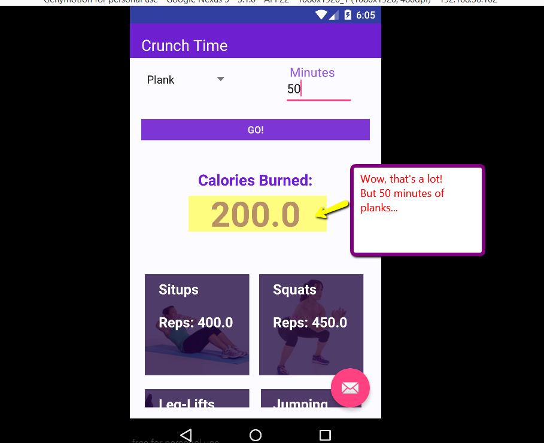

# PROG 01: Crunch Time

This app allows the user to input an exercise and time spent/reps to get the calories burned.  It also shows the user the reps/minutes needed to do the other exercises to get the same amount of calories.

## Authors

AnnaMarie Garlin ([agarlin18@berkeley.edu](mailto:agarlin18@berkeley.edu))

## Demo Video

See Crunch Time! (https://www.youtube.com/watch?v=DBiTWwK8084)

## Screenshots

## Acknowledgments

* Hat tip to anyone who's code was used
* Any other support

